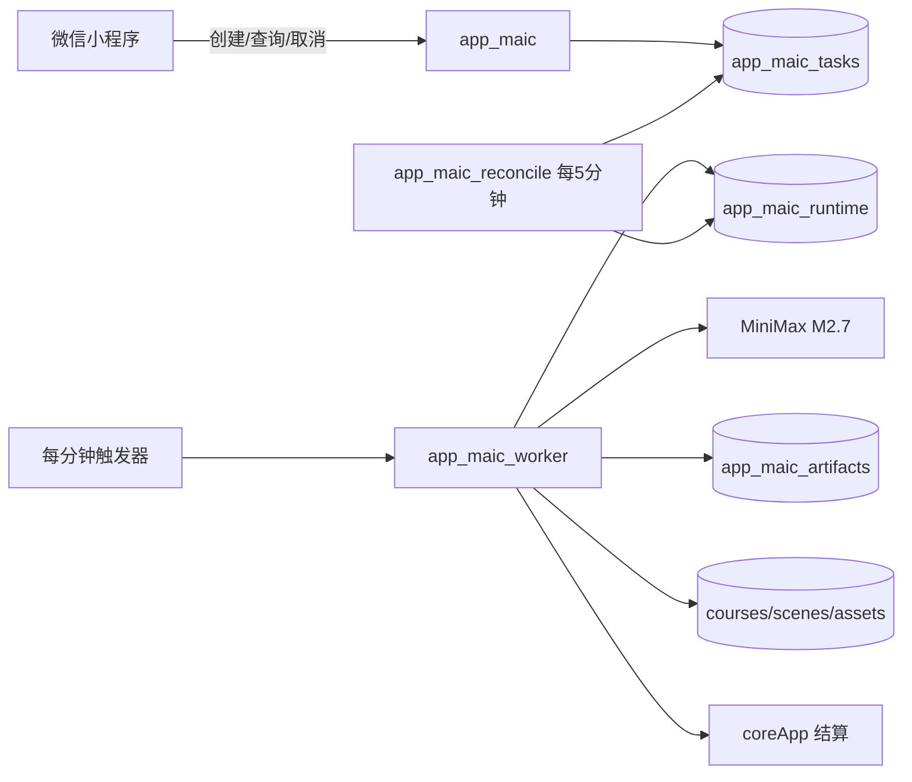

# MAIC CloudBase 原生化 — 设计

## 架构

`app_maic` 只承担可信用户身份下的任务 CRUD、课程读取、进度和资产删除；不发起 HTTP/HMAC 请求。`app_maic_worker` 是 Node.js 18.15 Event Function，超时 300 秒，每次触发最多认领一个任务。`app_maic_reconcile` 只做旧状态迁移、过期租约恢复、45 分钟超时和失败收口。

## 状态机与幂等

- 新状态：`queued -> processing -> importing -> succeeded`。
- 终态：`failed`、`cancelled`、`timed_out`；旧 `submit_pending` 在 reconcile 中迁移为 `queued`。
- `usageId` 同时作为任务、artifact、课程导入和结算的幂等关联键；课程/场景文档 ID 可确定性生成。
- `app_maic_runtime/worker` 保存 `leaseOwner`、`leaseExpiresAt` 和当前 usage；事务内认领/释放，租约超时后由 reconcile 恢复。
- artifact 仅保存已验证的课程；导入成功、取消或终态后删除。

## 生成与错误策略

- 默认 `MAIC_AI_MODE=cloudbase_custom`，GroupName `custom-minimax`，模型 `MiniMax-M2.7`。
- 若目标套餐不支持自定义模型，部署时明确切换为 `direct_minimax`，仅 Worker 环境保存 `MINIMAX_API_KEY`，BaseURL 为 `https://api.minimaxi.com/v1`；运行时不做双路重试。
- 协议错误：初次生成 + 最多一次纠错；仍失败则生成确定性兜底课程，不消耗额外模型请求。
- 网络、限流、上游 5xx：按 `nextAttemptAt` 最多三次；耗尽后 fail usage。
- 日志只记录 requestId、usageId、状态、重试次数和 token 用量，不记录密钥、完整 Prompt 或完整课程。

## 数据与权限

- 新增私有集合 `app_maic_runtime`、`app_maic_artifacts`。
- `app_maic_tasks` 新增 `status + nextAttemptAt` 和 `userId + createdAt` 索引。
- 客户端无权直接写入这些集合；所有写操作由云函数完成，用户身份只取 `cloud.getWXContext().OPENID`。
- 用户每日限额按 `userId + createdAt` 统计，默认 3 门，可由环境变量降低但不得绕过服务端校验。

## 协议与上游维护

- Worker 核心只移植 MIT 许可允许的协议、Prompt、JSON 修复、normalizer、validator、fixture 和测试。
- 原生协议过滤 HTML/脚本/危险 URL，验证 PBL scene 引用并删除所有 `navigate`。
- 核心目录记录来源仓库、归档 commit、上游基准 SHA 和本地改造；脚本只读比较 OpenMAIC `main`，仅输出 compare URL。

## 验证与回滚

- 纯函数单测覆盖协议、过滤、PBL、兜底课程、状态机和租约。
- CloudBase 先建集合/索引/权限，再部署无 timer Worker 并人工 smoke；成功后创建每分钟 timer，再部署 API/reconcile。
- 真实 usage 验收后台生成、取消、限流、失败、超时、跨用户访问和旧课程播放。
- 回滚仅将 `maic` 设为 `disabled`，不恢复本机独立服务。
