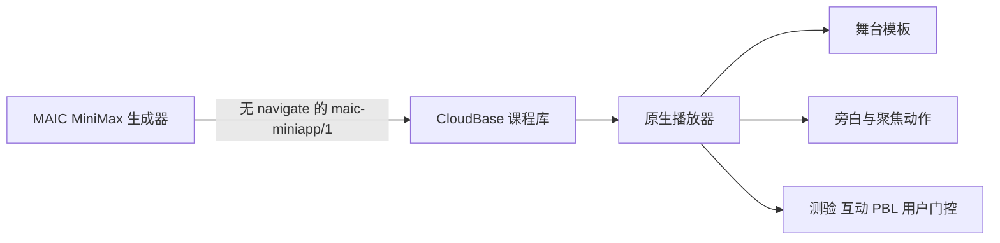

# MAIC 原生课堂舞台 V2 — 设计

## 架构

生成侧继续输出 `maic-miniapp/1`。`navigate` 保留为旧协议可解析字段，但生成器会移除它；播放器也把它视为已废弃动作。可选 `presentation` 字段只提供模板提示，缺失时由客户端推导，属于向后兼容扩展。

## 原生舞台

- 外围使用平台暖米背景，舞台使用既有 MAIC 深墨、蓝、青和冷灰 Token。
- 顶部为章节轨道、页码与场景类型；标题采用偏置编辑式布局。
- 内容区按 `hero`、`focus`、`compare`、`process`、`caseboard`、`challenge` 模板组织；模板由 `presentation.layout` 或内容类型推导。
- 底部教师浮层常驻，包含 CSS 图形化教师标识、状态和旁白；无旁白时显示场景引导语。
- 高亮、聚光和激光继续定位到结构化 block；不执行任意内容样式。
- 翻页只能由底部控制条的明确按钮触发。互动场景根据完成状态改变按钮文案和可用性。

## 动作生命周期

- 每次打开场景、页面隐藏、页面卸载都会递增运行令牌。
- `speech` 的停留时间按中文字符估算并限制在 1.8–8 秒；不等同于完整 TTS，但保证内容可读。
- `highlight`、`spotlight`、`laser`、`pause` 保持顺序执行。
- `navigate` 永远被忽略并记录兼容性处理，不触发翻页。

## 兼容性与测试

- 已导入 CloudBase 的旧课程无需迁移。
- 生成器在归一化阶段剔除 `navigate`，同时提示模型不得生成。
- 协议 fixture 覆盖旧 `navigate` 可解析但生成结果无该动作。
- 小程序单元测试覆盖阅读时长、布局推导、互动门控和动作过滤；静态门禁覆盖 WXML/WXSS/JS。

